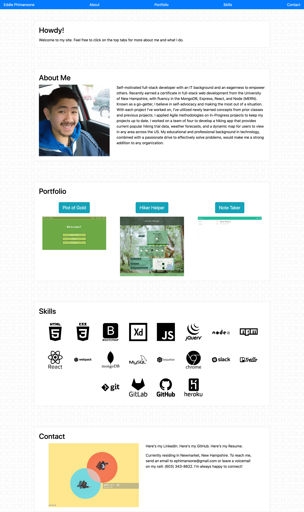

# Eddie Phimansone Portfolio

-------------------------------------------------- Personal Notes -------------------------------------------------

Deployed GitHub Pages Link: https://eddiephi.github.io/EddiePhiPortfolio/

Description:
I built a responsive web portfolio from scratch using Semantic HTML, Bootstrap, and custom CSS. The portfolio has responsive images and functional links to several different pages, each detailing different information about me an what I do as a Software Developer.

Technologies: HTML5, CSS3, Bootstrap

Screenshot: 

License: MIT

I used https://validator.w3.org/nu/ to validate my work.

---------------------------------------------------- Contact ----------------------------------------------------

Email: ephimansone@gmail.com 

LinkedIn: https://linkedin.com/in/eddiephi

GitHub: https://github.com/EddiePhi

Portfolio: https://eddiephi.github.io/EddiePhiPortfolio/

